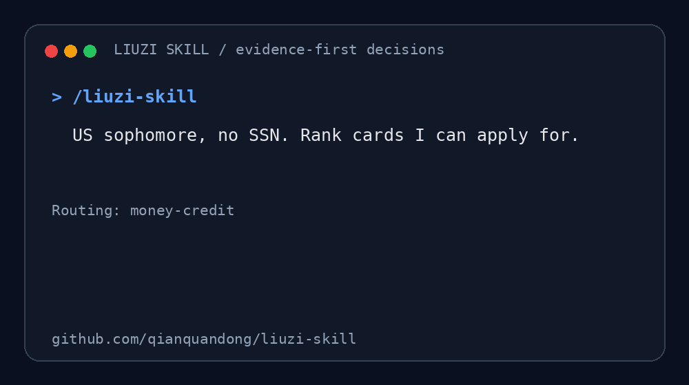

<div align="center">

# 🇺🇸 Liuzi Skill

### 中国留学生在美国的证据驱动型 AI 生存副驾驶

**不是生活百科。是“我现在该怎么办？”执行器。**

*Evidence-first AI copilot for housing, credit cards, cars, healthcare, F-1/OPT and everyday decisions.*

给留子（留学美国的中国留学生）用的 AI Skill：租房、信用卡（无 SSN / ITIN）、买车、医疗、F-1 / OPT / STEM OPT 签证身份问题，每个决策先过 Evidence Gate。<br>
An agent skill for Chinese international students in the US — apartment & lease hunting, credit cards with no SSN / ITIN, car buying, healthcare, F-1 / OPT / STEM OPT visa questions — with evidence-gated decision support. Works with Claude Code, Codex and other Agent Skills clients.

[](./VERSION)
[](https://github.com/qianquandong/liuzi-skill/actions/workflows/ci.yml)
[](https://skills.sh/qianquandong/liuzi-skill)
[](./evals/evals.json)
[](./LICENSE)

`实时查证` · `Evidence Gate` · `all-in 计算` · `硬约束淘汰` · `明确下一步`

<sub>留子 · 留学美国 · 中国留学生 · Chinese students in the US · study in USA · international students · 租房 housing · 信用卡 credit cards · 买车 car buying · 医疗 healthcare · F-1 · OPT · 证据驱动 evidence-first · AI skill · Claude Code · Codex</sub>

</div>

---

## 直接这样问

```text
/liuzi-skill 我是美国大二学生，没有 SSN，从夯到拉排名我现阶段能申请的信用卡
```

也可以直接说：

- 帮我选学校附近的公寓，预算 all-in $1,500
- 预算 $10k，帮我买第一辆二手车
- 我做自媒体收钱会不会影响 F-1？
- 我发烧了，该去校医院、Urgent Care 还是 ER？
- 12 月回长沙，最多转一次，帮我算真实总成本

`/liuzi-skill` 是兼容自然语言的显式前缀；支持 Agent Skills 的客户端也可用 `$liuzi-skill` 调用。



## v3.2 的关键变化

以前，Skill 可能会把“社区里有人成功”写得像“官方允许申请”。现在每个决策先过统一 Evidence Gate：

| 决策层 | 必须回答 |
|---|---|
| 能不能 | 官方资格是否直接覆盖你的条件 |
| 批不批 | 仅做有依据的概率判断，不承诺 |
| 值不值 | 把费用、hard pull、风险与长期价值算进去 |
| 能否排名 | `合理推测` / `无法验证` 不进入正式排名 |

证据状态统一为：`官方直接确认`、`第一方自述`、`第三方支持`、`合理推测`、`无法验证`。

## 回答长什么样

### Before

```text
没 SSN 可以试试 A、B、C，A 最好。
```

问题：没有核验资格，把“能申请、可能获批、值得申请”混在一起，也没有说明哪些只是传闻。

### After

```text
核验日期：2026-09-13
已知：大二、无 SSN；待确认：年龄、ITIN、信用档案、可申报收入。

正式排名
1. A — 官方直接确认接受你的材料路径；获批概率未知；年费 $0
2. B — 资格满足，但需要押金；作为回退方案

未进入排名
- C — 只有第三方帖子支持，官网未确认无 SSN 路径。

我最推荐：先走 A 的官方 pre-qualification。
你现在直接做：核对申请页材料 → 确认是否 hard pull → 提交前停下复核。
```

这个示例只展示输出结构，不代表当前产品资格或报价；运行时必须重新查询。

## 核心能力

| 场景 | 执行链 |
|---|---|
| 💳 信用 | 年龄/SSN/ITIN/信用档案 → 官方资格 → 获批路径 → 是否值得 → 单次申请 gate |
| 🏠 租房 | 实时库存 → no-credit 路径 → all-in → 高峰通勤 → lease → 付款/签约 gate |
| 🇺🇸 F-1/OPT | 身份事实 → 活动事实 → 当前官方依据 → 时间线 → DSO/律师升级 |
| 🚗 买车 | VIN/title/recall → PPI → 保险 → itemized OTD → 持有期 all-in |
| 🏥 医疗 | 紧急分流 → network → 路径与费用 → EOB/bill audit |
| ✈️ 机票 | 日期网格 → 行李/地面交通 → 联程 vs self-transfer → all-in |
| 📦 海运 | 禁限运 → 体积重 → 附加费 → 清关 → 赔付 |
| 其他 30+ 场景 | 按需加载 `references/` 中对应 playbook |

## 决策引擎


## 安装

### Agent Skills CLI（Codex、Claude Code、Cursor 等）

推荐一条命令：

```bash
npx skills add qianquandong/liuzi-skill
```

安装器会让你选择目标 Agent 和 scope。也可手动克隆后，把整个目录放入该客户端的 skills 目录。

### Codex CLI 手动安装

```bash
git clone https://github.com/qianquandong/liuzi-skill.git ~/.codex/skills/liuzi-skill
```

### Claude Code 手动安装

```bash
git clone https://github.com/qianquandong/liuzi-skill.git ~/.claude/skills/liuzi-skill
```

### ChatGPT Work

GitHub clone 命令不会自动把 Skill 加到 ChatGPT Work。请在产品内的 Skills 管理入口安装/导入；安装后使用 `$liuzi-skill`，或直接发送中文问题。仓库中的 `.codex-plugin/`、`.claude-plugin/` 与 `agents/openai.yaml` 提供对应客户端的发现信息。

## 可测试，不靠口号

仓库自带 30 条真实回归场景，覆盖无 SSN 信用卡、under-21 收入、no-browser、官方/社区冲突、租房诈骗、F-1 变现、OPT 未授权开始、dealer 月供陷阱、医疗急症、海关低报等。

```bash
python3 -m unittest discover -s tests -v
python3 scripts/check_source_links.py .
```

确定性工具：

```bash
python3 scripts/calculate_all_in.py input.json
python3 scripts/score_options.py options.json
python3 scripts/validate_evidence.py evidence.json
python3 scripts/lint_answer.py answer.md --risk high --require-recommendation
python3 scripts/check_source_links.py .
```

Python 脚本只使用标准库。

## 项目结构

```text
liuzi-skill/
├── SKILL.md                     # 总入口、路由与行为契约
├── references/                  # 场景 playbooks + Evidence Gate
├── scripts/                     # 计算、排序和验证工具
├── evals/evals.json             # 30 条行为回归题
├── tests/                       # 可直接运行的单元/结构测试
├── examples/                    # 完整回答示例
├── templates/                   # checklist / quote / decision table
├── agents/openai.yaml           # OpenAI 客户端展示信息
├── .codex-plugin/               # Codex 分发信息
├── .claude-plugin/              # Claude 分发信息
└── .github/workflows/           # CI 与 tag release
```

## 贡献

提交真实边界问题比继续堆“大而全”章节更有价值。请看 [CONTRIBUTING.md](./CONTRIBUTING.md)，或使用 Issue 模板提交错误回答、失效来源和新 eval。

## 研究与安全原则

1. 身份、税务、法律、医疗、安全、资格与签约：直接官方来源优先。
2. 公寓体验、餐馆、社群：实时地图、近期评论与社区体验可以补充，不能替代规则。
3. 价格、库存、政策、优惠、费用和时限：本次运行重新查询并标注日期。
4. 比价格统一算 all-in，先淘汰硬伤，再加权评分。
5. 付钱、签约、提交、取消、发送等不可逆动作前停下来确认。
6. 不索取 SSN 全号、护照号、银行卡完整号码、验证码或不必要的精确住址。

本 Skill 不替代律师、DSO、医生、CPA 或保险专业人士。它的职责是找到当前权威依据、整理事实、标出不确定性，并把下一步变得可执行。

---

<div align="center">

**从刚下飞机，到毕业离开美国。**

MIT © Jack Qian

</div>
